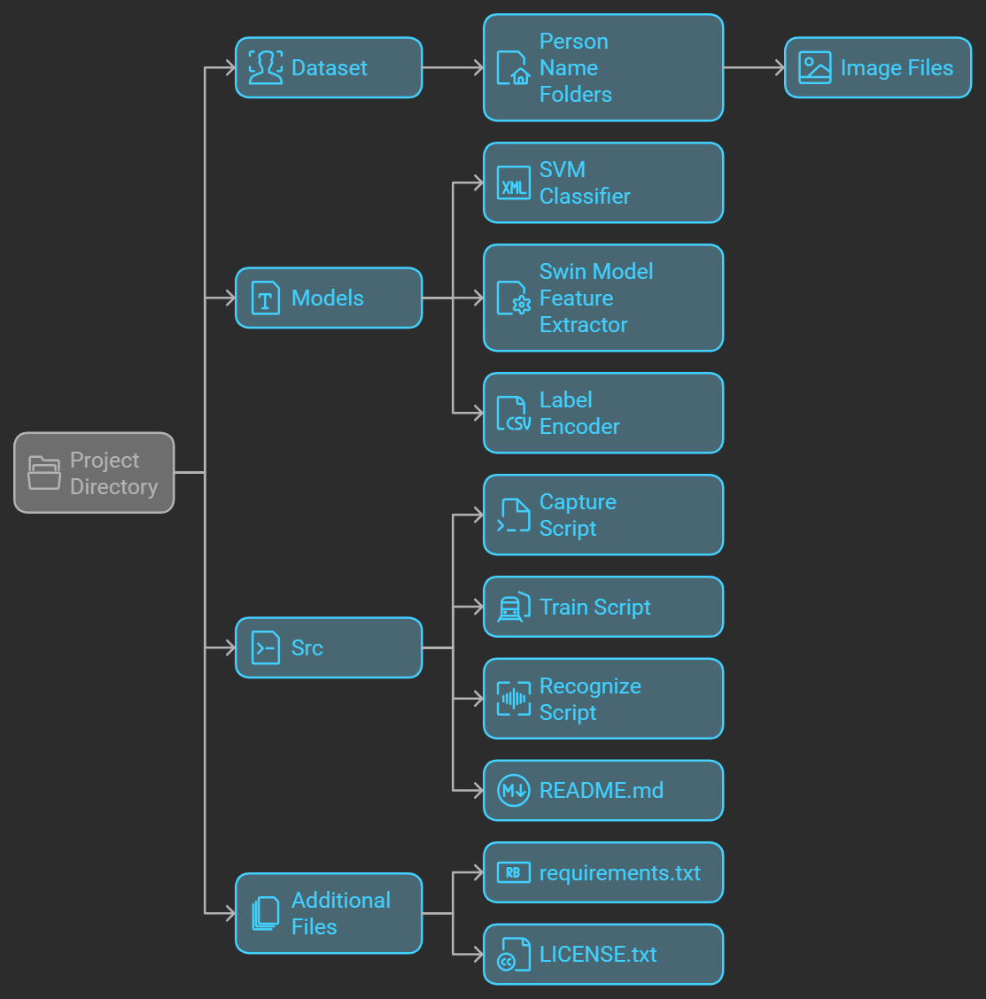

# swin_face_recognition

switch to master branch !

https://github.com/user-attachments/assets/94d5e41c-9344-473e-8bf7-41ba23f34e6f

# Face Recognition System with Swin Transformer and SVM Classifier

This repository contains an advanced face recognition solution that uses the **Swin Transformer model** for feature extraction and an **SVM classifier** for identifying individuals. The application performs real-time face recognition using webcam input.

## Project Overview

This system utilizes deep learning for **face recognition** by:
1. **Feature Extraction**: Using a pre-trained Swin Transformer model to extract features from face images.
2. **Face Recognition**: Classifying the face using a trained SVM classifier, which predicts the person's identity.

## Features
- **Real-time Face Recognition**: Capture and recognize faces using a webcam in real-time.
- **Face Image Collection**: The system collects face images for training by detecting faces and saving them into specific folders.
- **Swin Transformer Model**: The Swin Transformer is used as a feature extractor for face images, extracting high-quality features for classification.
- **SVM Classifier**: The SVM classifier is trained on the extracted features to recognize faces and identify individuals.
- **Confidence Score**: Each recognition includes a confidence score indicating the certainty of the classification.

## Folder Structure

## Installation Instructions  

### Step 1: Clone the Repository  
To clone the repository to your local machine, use the following command:  
git clone https://github.com/ketakibharati8/Face_Recognition_System_with_Swin_Transformer_and_SVM_Classifier.git

Then, navigate into the project directory by running:

cd FaceRecognition_Swin_Transformer

### Step 2: Set Up Virtual Environment
It's recommended to use a virtual environment to avoid dependency issues. To create a virtual environment, run:

python -m venv venv

Then activate the virtual environment:

For Linux/MacOS:
source venv/bin/activate

For Windows:
venv\Scripts\activate

### Step 3: Install Dependencies
To install the required Python dependencies, run:

pip install -r requirements.txt

### Step 4: Run the Application
To start the real-time face recognition system, run the main script:

python recognize.py

This will open a webcam window for capturing and recognizing faces. Press 'q' to quit.

## How to Use the Application

### Step 1: Capture Training Images
1. Run the capture.py script to start the image capture process.
2. When prompted, enter the person's name.
3. The system will detect faces in real-time and save 50 images per person.
4. These images are saved under a directory with the person's name inside the dataset/ folder.

### Step 2: Train the Classifier
1. Once you've captured enough images (at least 50 per person), the SVM classifier can be trained by running the following script:
   
   python train.py

2. This will extract features from the images using the Swin Transformer model and train the SVM classifier to recognize the individuals.

### Step 3: Real-Time Face Recognition
1. After training the classifier, run the recognize.py script again.
2. The system will use your webcam to capture faces and display the recognized person's name along with the confidence score.
3. Press 'q' to exit the recognition system.

## Code Explanation

### Helper Functions

#### capture.py
- **`load_dataset(data_dir)`**: Loads face images and their corresponding labels from the dataset directory.
- **`extract_features(images, model, image_processor)`**: Extracts features from the images using the Swin Transformer model.

#### train.py
- **`extract_features(images, model, image_processor)`**: Extracts features from the images using the pre-trained Swin Transformer model.
- **`train_svm_classifier(X_train, y_train)`**: Trains an SVM classifier using the extracted features from the dataset.

#### recognize.py
- **`preprocess_image(image)`**: Preprocesses the image for the Swin Transformer.
- **`recognize_faces(frame, model, classifier, label_encoder)`**: Recognizes faces in a given frame and predicts the identity using the trained SVM classifier.

### Key Modules

- **Swin Transformer**: A pre-trained Swin Transformer model is used to extract high-level features from face images.
- **SVM Classifier**: The SVM model classifies face images based on the extracted features.
- **OpenCV**: OpenCV is used for capturing images from the webcam and displaying results.

